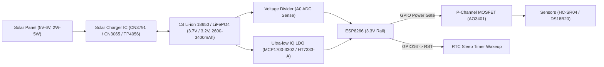

# Solar Power & Deep Sleep Implementation Plan

## Overview
This plan establishes **P1 Firmware Upgrades** focused on sleep energy savings, fast cycle recovery, sensor power gating, and backend integration. It also outlines the **Solar Trickle-Charged Power System Architecture** designed to remove reliance on AC power for the AquaMind Smart Water Tank sensor node.

---

## 1. Solar Trickle-Charged System Architecture (Off-Grid / Off-AC)

To operate 24/7 without AC power, the system utilizes a solar-charged single-cell Li-Ion / LiFePO4 battery setup with low-quiescent power management.

### Key Components & Hardware Recommendations
1. **Solar Panel**: 5V - 6V / 2W - 5W monocrystalline solar panel (~400mA–800mA peak output).
2. **Battery**: 1S 18650 Li-Ion (3.7V nominal, 4.2V max, 2600–3400 mAh) or LiFePO4 cell (3.2V nominal, 3.65V max for higher heat tolerance in outdoor tanks).
3. **Solar Charge Controller**:
   - **Recommended**: **CN3791** or **CN3065** MPPT / Solar Charger module (specifically designed for solar input voltage drops).
   - **Alternative**: TP4056 module with DW01A battery protection (requires steady 5V panel output).
4. **Voltage Regulation (LDO)**:
   - **Crucial**: standard NodeMCU boards use the **AMS1117-3.3V** regulator which draws **~3–5 mA continuous quiescent current** even when the ESP8266 is in deep sleep!
   - **Fix**: Bypass/replace AMS1117 with an ultra-low quiescent LDO such as **MCP1700-3302E** or **HT7333-A** (quiescent current: **~1.6 µA – 4 µA**), or power directly via 3V3 rail.
5. **Sensor Power Gating**:
   - The HC-SR04 ultrasonic sensor draws **~15 mA idle current** when left powered.
   - A P-Channel MOSFET (e.g. AO3401) or NPN/PNP switch on `PIN_SENSOR_POWER` turns off sensor power completely during ESP deep sleep, reducing sensor standby draw to **0 µA**.
6. **Deep Sleep Hardware Link**:
   - Connect **GPIO16 (D0)** to **RST** with a 470Ω - 1kΩ resistor or direct wire to allow timer-based wakeups from `ESP.deepSleep()`.

---

## 2. P1 Firmware Upgrades - Sleep Energy Saving System

### Proposed Firmware Enhancements

#### A. Fast WiFi Reconnect via RTC Memory
- Standard `WiFi.begin(ssid, pass)` spends **3 to 5 seconds** scanning all 13 WiFi channels.
- **Upgrade**: Store the WiFi BSSID (AP MAC address) and Channel in RTC memory during the first successful cycle.
- On wake-up from deep sleep, read RTC memory and call `WiFi.begin(ssid, pass, channel, bssid)`.
- **Result**: WiFi connection time reduced from **3500ms -> ~400ms**, saving substantial mAh per cycle.

#### B. Sensor Power Gating & Warmup Management
- Add `#define PIN_SENSOR_POWER 12 // GPIO12 (D6)` (configurable).
- In `Sensor::init()`, assert `PIN_SENSOR_POWER HIGH` to switch on sensors.
- Take measurements with minimum warmup delay (`100ms`).
- Immediately assert `PIN_SENSOR_POWER LOW` before entering deep sleep.

#### C. Adaptive Low-Battery Duty Cycling
- Read battery voltage before each transmit cycle.
- If battery voltage drops below warning threshold (e.g. `< 3.4V`), dynamically scale up the deep sleep interval (e.g. from 5 minutes to 30 minutes) to preserve essential battery reserve.

#### D. Operational Awake-Budget Enforcement
- Strict cap on awake time (`MAX_AWAKE_TIME_MS = 10000ms`). If WiFi or MQTT fails to connect within 10 seconds, save error state to RTC and force deep sleep with exponential backoff.

---

## 3. Backend & Telemetry Enhancements

### Proposed Server & MQTT Schema Updates
1. **Telemetry Payload Fields**:
   - `battery_v`: Battery voltage in Volts (e.g. `3.85`).
   - `battery_pct`: Calculated battery state-of-charge percentage (`0 - 100%`).
   - `rssi`: Signal strength in dBm.
   - `sleep_duration_sec`: Sleep interval reported back by the device.
2. **Server Config Sync**:
   - Allow server to push `reportIntervalMs` over MQTT retained config so sleep intervals can be updated remotely without reflashing.
3. **Backend Battery Health Alerts**:
   - Trigger alert notifications if `battery_v < 3.3V` or if solar charging has failed over a 24-hour period.

---

## Technical Specifications for Power Calculations

| Phase / State | Typical Current Draw | Duration / Notes |
| :--- | :--- | :--- |
| **Deep Sleep (ESP8266)** | ~20 µA (chip only) | ~1.6 µA LDO + 0 µA gated sensors = **< 25 µA total** |
| **Active Sensor Sampling** | ~25 mA | ~100–200 ms |
| **WiFi RF Transmission** | ~120 mA – 170 mA (peak) | ~400 ms (Fast RTC connect) to ~2000 ms |
| **Awake Duty Cycle Total** | Avg ~80 mA | ~1.5 - 2.5 seconds total awake per cycle |
